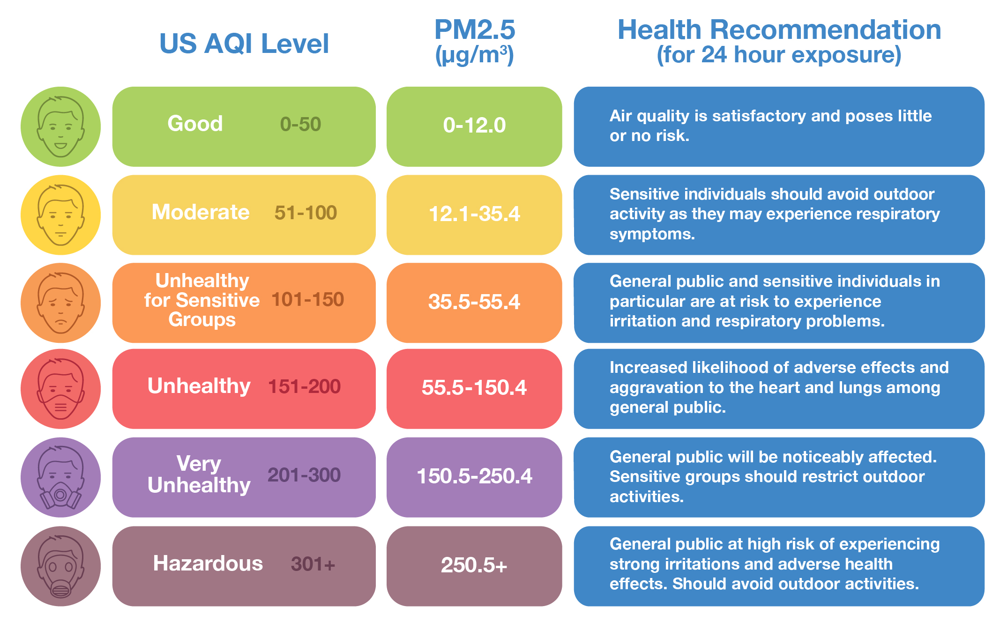

  

## What is the AQI?

In the United States, the air quality index (AQI) is the standard air quality measurement and based on the [EPA's air quality index](https://www.airnow.gov/aqi/aqi-basics/). The index is calculated on a daily basis and based on concentrations of the following major pollutants:  

1. Ground-level ozone  
2. Particulate matter (PM2.5 & PM10)
3. Carbon monoxide  
4. Sulfur dioxide  
5. Nitrogen dioxide    

AQI values can range from 0 to 500, with lower numbers representing better air quality and higher numbers representing worse air quality. The index also details the range of values associated with categories of air quality: good, moderate, unhealthy for sensitive groups, unhealthy, very unhealthy, and hazardous.  

  

  

## Why use the AQI?

Individuals with asthma are considered to be a sensitive group. Location-specific AQI may be helpful for individuals to self-manage their asthma. Cities with historically higher AQI can also supplement warning days to protect the health of the public. 