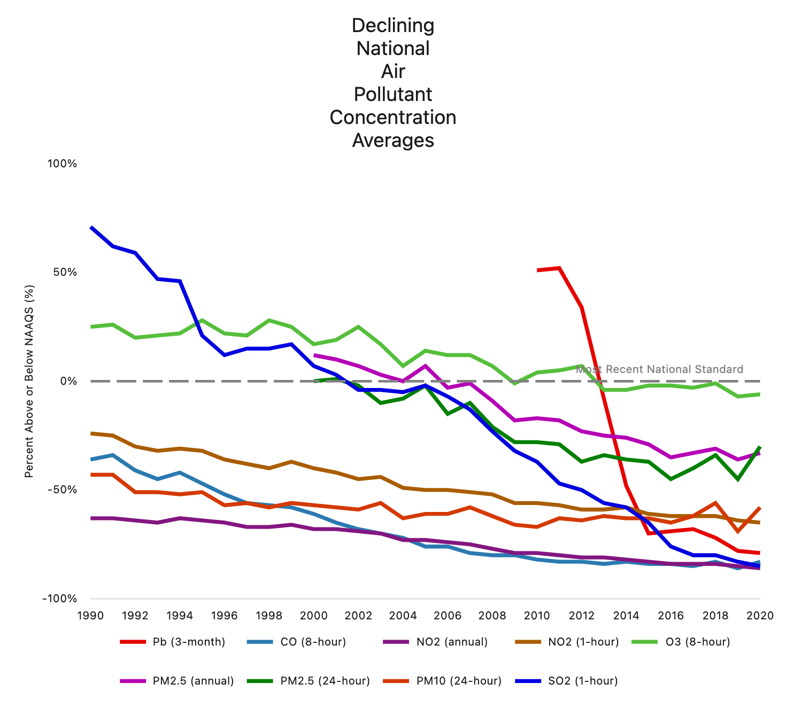
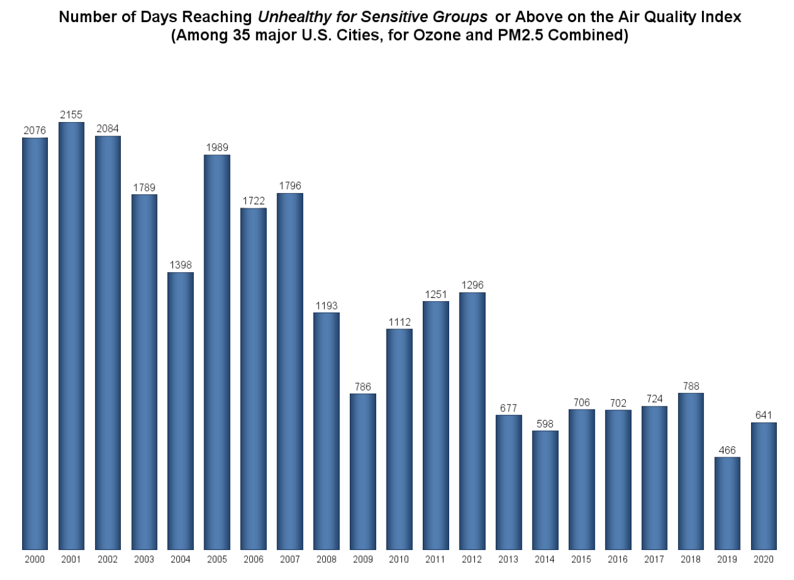

<br></br>

# Our Motivation

Our motivation was linked with the recurring episodes and increased frequency of wildfire outbreaks in the United States, specifically Pacific Northwest, caused by the rise in global temperature. The air quality resulting in these fires are not only concentrated in the Pacific Northwest, but also travel across the country by wind patterns.  

This interest grew to embody a curiosity of air quality across the nation that is not restricted to the events of wildfires. The complex nature of air quality cannot be subject to one type of event only. Air quality is highly linked with the incidence of asthma, especially young children. It is a major noncommunicable disease that can be self-managed given the proper tools and information. This includes information on air quality. 

<br></br>

# Related Work

One of the most interesting aspects of this class for us was seeing the story that data can tell through visualization. R is especially ideal for this, and it inspired us to create dynamic graphics that could show the impact of air pollution on health. We hope that work like this can inform policy to protect people-- especially vulnerable populations-- from the consequences of climate change. 

When brainstorming, a driving factor to focus on this topic was Tara's experience working with pediatric patients suffering from respiratory problems linked to air pollution. Most had come from regions where deforestation is prevalent, leading to increased pollution and debris in the air. The state and federal fines for these actions are not large enough to disincentivize the large corporations from these practices, leading to children bearing the brunt of the consequences. 

### EPA 2020 Air Trends Report

Accordingly, we conducted a search for research on air quality and came across the [EPA's 2020 Trends Report](https://gispub.epa.gov/air/trendsreport/2021/) which summarized how air quality trends show clean air progress. 

<center><iframe width="420" height="236" src="https://gispub.epa.gov/air/trendsreport/2021/video/MP4/airpollution_animation_4x3.mp4" frameborder="0" allow="accelerometer; autoplay"allowfullscreen></iframe></center>

Through this report, we also came across the striking video above, showing the variety of pathways in which human health and the environment is impacted by air pollution, consisting of gas and particle contaminants that are present in the atmosphere. As illustrated by the video, some pollutants are released directly into the atmosphere while other pollutants are formed in the air from chemical reactions. Ground-level ozone forms when emissions of NOx and VOCs react in the presence of sunlight. 

### Trends in Air Pollution and Quality

From there, we were intrigued to see whether there have been decreases in air pollution in the U.S. 

#### Air Pollutant Emissions Decreasing

We found that since 1990, emissions of key air pollutants (primarily from stationary fuel combustion, industrial processes, highway vehicles, and non-road mobile vehicles) have continued to decline. These reductions have been driven by federal and state implementation of stationary and mobile source regulations. 

<center><a href=""></a></center>
_**Source:** U.S. Environmental Protection Agency_

According to the EPA, it was actually the implementation of the Clean Air Act in 1970 and subsequent technological advances from American innovators that dramatically improved emissions in the U.S.  

#### Air Quality Trends Show Clean Air Progress

Furthermore, the [EPA](hhttps://gispub.epa.gov/air/trendsreport/2021) has reported that air quality has improved in the past decade. 

<center><a href=""></a></center>
_Source: U.S. EPA Air Quality System_

<center><a href=""></a></center>
 
_Source: U.S. Environmental Protection Agency_

_Note: Sensitive groups for ozone and PM2.5 include people with heart or lung disease, older adults, children and teenagers, and people who are active outdoors._

While some pollutants continue to pose serious air quality problems in areas of the U.S., the EPA's 2020 report claims that nationally, concentrations of air pollutants have dropped significantly since 1990:

* Carbon Monoxide (CO) 8-Hour, <i class="fas fa-arrow-down"></i> 73%
* Lead (Pb) 3-Month Average, <i class="fas fa-arrow-down"></i> 86% (from 2010)
* Nitrogen Dioxide (NO2) Annual, <i class="fas fa-arrow-down"></i> 61%
* Nitrogen Dioxide (NO2) 1-Hour, <i class="fas fa-arrow-down"></i> 54%
* Ozone (O3) 8-Hour, <i class="fas fa-arrow-down"></i> 25%
* Particulate Matter 10 microns (PM10) 24-Hour, <i class="fas fa-arrow-down"></i> 26%
* Particulate Matter 2.5 microns (PM2.5) Annual, <i class="fas fa-arrow-down"></i> 41% (from 2000)
* Particulate Matter 2.5 microns (PM2.5) 24-Hour, <i class="fas fa-arrow-down"></i> 30% (from 2000)
* Sulfur Dioxide (SO2) 1-Hour, <i class="fas fa-arrow-down"></i> 91%

Note that these major air pollutants are represented in the Air Quality Index (AQI), which is what we decided to focus on for conciseness (rather than trying to gather data on each individual pollutant). We have written in-depth details regarding the AQI, which can be found [here](background.html).

Our team found it interesting that the report concluded that despite the increases in air concentrations of pollutants associated with fires, carbon monoxide and particle pollution, national average air quality concentrations remain below the current, national standards. It was great to see taht air quality trends currently indicate clean air progress in the U.S.

However, this made us wonder: **if there were improvements in air quality in the U.S., would there be decreases in asthma prevalence over time as well**?

<br></br>

# Initial Questions and Hypotheses

Consequently, our main question of interest is as follows:

**How has air quality impacted asthma over time in the United States?**

Specifically, we want to test the changes in air quality index (AQI) and self-reported asthma from 2013-2020.

**Correlation between AQI and Asthma**

We hypothesize that as the AQI increases in value, indicating a greater level of air pollution, the prevalence of asthma will increase. So, between the air quality index (AQI) and  We believe this to be true for two main reasons:

* The higher the AQI value, the greater the level of air pollution, and in turn the greater the health concern. Therefore, there should be a positive relationship between AQI and asthma prevalence
* REASON 2

We will conduct exploratory analyses to assess state-by-state and county-by-county differences in air quality and asthma over time, and then run statistical analyses to address our question of whether the United States is seeing a correlation between air quality and asthma between 2013-2020. 

<br></br>

# Data

### Our Data Sources

#### EPA Data
Information on AQI was collected from the Environmental Protection Agency from 2013 - 2020. AQI data is collected on a daily basis from monitors stationed around the country and in every state. The EPA provides summarized annual data on each state and its respective counties. EPA is representative at the state level and can be compared from year to year.

AQI data for each year between 2013 and 2020 were downloaded as .csv files and imported into R. We merged the .cvs files across all years and kept information pertaining to state name and information associated with the relevant air pollutants: ground level ozone, carbon monoxide, nitrogen dioxide, sulfur dioxide, PM2.5, and PM10. We summarized the median AQI for each state over every year. Therefore each state had 7 observations.

In anticipation of merging this dataset with BRFSS data, we applied state codes to each state based on that which was included in the BRFSS data. 

**EPA AQI Limitations:**

Not all states included in the EPA dataset were also included in the BRFSS data. New Jersey, Guam, the Virgin Islands, and the City of Mexico were therefore excluded from our analysis. Additional limitations include the values of the AQI utilized in this project. The EPA provides annual median AQI data, mean AQI, and the 90th percentile of AQI per state and county. 

Although daily data per monitor site is also provided on the EPA website, it is based on the daily AQI on each _individual_ pollutant and not the daily aggregated AQI value. We attempted to calculate the AQI values based on daily data. However, we found those values to be inaccurate when comparing to the provided values of median AQI on the EPA website. This is due to the lack of information of how states/counties were weighted in geographical size, population count, vehicular activity, and/or industrial activity.. Therefore, AQI values utilized were limited to what was provided in the annual data. This restricted the types of comparison analysis we could do or the assessment of the distribution of AQI values per state, county, and nation. The median AQI data was the most reliable option available. 

#### Behavioral Risk Factor Surveillance System (BRFSS) Data

Information on asthma was collected from the Behavioral Risk Factor Surveillance System (BRFSS) years 2013-2020. The BRFSS is a phone-conducted health survey of households administered by states and is available at the state level and at the level of metropolitan statistical areas (MMAs) through the Selected Metropolitan/Micropolitan Area Risk Trends of BRFSS (SMART BRFSS) addition. For data available in the SMART BRFSS addition, county-level asthma estimates reflect data aggregated at the metropolitan statistical area level. BRFSS data is representative at the state level and can be compared from year to year. 

BRFSS data for each year between 2013 and 2020 were downloaded as .xpt files and imported into R. We selected and cleaned demographic and asthma related variables, including transforming categorical variables into factors and setting "unknown" responses to missing. Additionally, as variable names in the BRFSS data were not consistent year-to-year, we renamed all variables to be identical. After cleaning each dataset, we binded the datasets lengthwise to make a master BRFSS dataset containing BRFSS year, interview data, demographic information, variables related to asthma, and weighting variables.

<br></br>

### Data Scraping and Cleaning

```{r setup, include=FALSE}
knitr::opts_chunk$set(echo = TRUE)
library(tidyverse)
library(dplyr)
library(plotly)
library(flexdashboard)
library(viridis)
```

#### Code that Merges EPA & BRFSS
##### Reading in and Cleaning EPA Data

```{r epa_cleaning, message=FALSE, warning=FALSE}
epa_df = 
  tibble(path = list.files("./data", full.names = TRUE)) %>% 
  mutate(data = purrr::map(.x = path, ~read_csv(.x))) %>% 
  janitor::clean_names() %>%
  unnest(data) %>%
  janitor::clean_names() %>%
  select(-c("path",
            "days_with_aqi",
            "max_aqi",
            "good_days":"hazardous_days", 
            "x90th_percentile_aqi")) %>%
  rename("days_pm2.5" = "days_pm2_5", "state_name" = "state") %>%
  mutate(state_code = state_name,
         state_code = str_replace_all(state_code, " ", ""),
         state_code = str_to_lower(state_code),
         state_code =  
           recode(state_code, 
             alabama = 1, alaska = 2, arizona = 4, arkansas = 5, 
             california = 6, colorado = 8, connecticut = 9, delaware = 10,
             districtofcolumbia = 11, florida = 12, georgia = 13, hawaii = 15, 
             idaho = 16, illinois = 17, indiana = 18, iowa = 19, kansas = 20, 
             kentucky = 21, louisiana = 22, maine = 23, maryland = 24, massachusetts = 25, 
             michigan = 26, minnesota = 27,mississippi = 28, missouri = 29, montana = 30, 
             nebraska = 31, nevada = 32, newhampshire = 33, newmexico = 35,
             newyork = 36, northcarolina = 37, northdakota = 38, ohio = 39, oklahoma = 40, 
             oregon = 41, pennsylvania = 42 , rhodeisland = 44, southcarolina = 45, 
             southdakota = 46, tennessee = 47, texas = 48, utah = 49, vermont = 50,
             virginia = 51, washington = 53, westvirginia = 54, wisconsin = 55, 
             wyoming = 56, puertorico = 72
             ),
         state_code = as.factor(state_code)) %>%
  na.omit(state_code) %>%
  relocate(state_code, state_name, everything())
```

#### Creating an EPA State-Level AQI DF

```{r, epa_state_level, message=FALSE, warning=FALSE}
state_epa_df = epa_df %>%
  group_by(state_code, state_name, year) %>%
  summarize(median = median(median_aqi)) %>%
  rename("median_aqi" = "median") 
```

#### Adding Column Combining State Code and Year for the Merge

```{r, epa_state_year_code, message=FALSE, warning=FALSE}
state_epa_df = state_epa_df %>%
  mutate(
    state_code_year = paste0(state_code, "_", year)
  ) %>%
  relocate(state_code_year, everything())
```

#### Merging EPA and BRFSS State-Level Data

* Read in the BRFSS data
* Made state a factor in the BRFSS DF
* Created a new column in BRFSS which concatenates state and year for the merge
* Merged EPA state-level data with BRFSS individual-level data

```{r, epa_brfss_merge, message=FALSE, warning=FALSE}
brfss_df = read_csv(file = "./brfss_data/brfss_12072021.csv")

brfss_factor_df = brfss_df %>%
  mutate(
    state = as.factor(as.character(state)),
    state_year = paste0(state, "_", iyear)
  ) %>%
  relocate(state_year, state, iyear, everything())

brfss_epa_df = 
  left_join(brfss_factor_df, state_epa_df, by = c("state_year" = "state_code_year"))

brfss_epa_df = brfss_epa_df %>%
  rename(epa_year = year) %>%
  relocate(state_year, state, state_name, iyear, everything())
```

Code Calculating Asthma Prevalence by State & Year

#### Import & Clean Merged DF

```{r, import_merged, message=FALSE, warning=FALSE}
merged_df <- read_csv("brfss_data/brfss_epa.csv")

merged_df <- merged_df %>%
  mutate(state = ifelse(state == 66, NA, state)) %>%
  drop_na() %>%
  mutate(state = factor(state, labels = c("AL", 'AK', "AZ", "AR", "CA", "CO", "CT", "DE", "DC", "FL", "GA", "HI", "ID", "IL", "IN", "IA", "KS", "KY", "LA", "ME", "MD", "MA", "MI", "MN", "MS", "MO", "MT", "NE", "NV", "NH", "NJ", "NM", "NY", "NC", "ND", "OH", "OK", "OR", "PA", "RI", "SC", 'SD', 'TN', 'TX', 'UT', 'VT', 'VA', 'WA', 'WV', 'WI', 'WY')))
```
#### Calculate Asthma Prevalence

```{r, asthma_prev, message=FALSE, warning=FALSE}
asthma_prev_df = merged_df %>%
  group_by(state_year, state, state_name, iyear, median_aqi) %>%
  count(asthma_current) %>%
  mutate(asthma_perc = (n/sum(n) * 100), asthma_perc = round(asthma_perc, 2)) %>%
  filter(asthma_current == "yes")
```

#### Example BRFSS Data Cleaning
```{r, eval = FALSE, collapse = TRUE, message=FALSE, warning=FALSE}
library(tidyverse)
library(janitor)
library(haven)

#Loading 2020 BRFSS Data
state2020 <- read_xpt("LLCP2020.XPT ") %>%
  clean_names()

state2020 <- state2020 %>%
  select(iyear, imonth, iday, ageg5yr, sexvar, race, state, casthm1, ltasth1, chccopd2, llcpwt, ststr, psu) %>%
  mutate(ageg5yr = na_if(ageg5yr, 14), ageg5yr = factor(ageg5yr, labels = c("18-24", "25-29", "30-34", "35-39", "40-44", "45-49", "50-54", "55-59", "60-64", "65-69", "70-74", "75-79", "80+")), sexvar = factor(sexvar, labels = c("male", "female")), race = na_if(race, 9), race = factor(race, labels = c("white", "black", "aian", "asian", "pacific islander", "other", "multiracial", "hispanic")), state = as_factor(state), casthm1 = na_if(casthm1, 9), casthm1 = factor(casthm1, labels = c("no", "yes")), ltasth1 = na_if(ltasth1, 9), ltasth1 = factor(ltasth1, labels = c("no", "yes")), chccopd2 = na_if(chccopd2, 9), chccopd2 = na_if(chccopd2, 7), chccopd2 = factor(chccopd2, labels = c("yes", "no"))) %>%
  rename(asthma_ever = ltasth1, asthma_current = casthm1, copd = chccopd2)

#Binding BRFSS annual sets
temp_df <- bind_rows("2020" = state2020, "2019" = state2019, "2018" = state2018, "2017" = state2017, "2016" = state2016, "2015" = state2015, "2014" = state2014, "2013" = state2013, .id = "brfss_year")
```

Similarly, SMART BRFSS data for each year between 2013 and 2019 were downloaded as .xpt files and imported into R and cleaned following the same approach described above for the BRFSS datasets. Counties and states corresponding to each MMA were identified by merging the SMART BRFSS dataset with a list of urban counties and states by FIPS code. MMA-level data for Guam, the Virgin Islands, and Puerto Rico were excluded due to incomplete data. It is important to note that county level data produced through this data reflect aggregated MMA-level estimates.

###Example SMART BRFSS Data Cleaning

```{r, eval = FALSE, collapse = TRUE, message=FALSE, warning=FALSE}
library(tidyverse)
library(janitor)
library(haven)

#Loading 2019 SMART data

city2019 <- read_xpt("mmsa/MMSA2019.XPT") %>%
  clean_names()

city2019 <- city2019 %>%
  select(mmsa, mmsaname, mmsawt, ageg5yr, sexvar, race, casthm1, ltasth1, chccopd2, ststr) %>%
  mutate(sexvar = factor(sexvar, labels = c("male", "female")), ageg5yr = na_if(ageg5yr, 14), ageg5yr = factor(ageg5yr, labels = c("18-24", "25-29", "30-34", "35-39", "40-44", "45-49", "50-54", "55-59", "60-64", "65-69", "70-74", "75-79", "80+")), race = na_if(race, 9), race = factor(race, labels = c("white", "black", "aian", "asian", "pacific islander", "other", "multiracial", "hispanic")), casthm1 = na_if(casthm1, 9), casthm1 = factor(casthm1, labels = c("no", "yes")), ltasth1 = na_if(ltasth1, 9), ltasth1 = factor(ltasth1, labels = c("no", "yes")), chccopd2 = na_if(chccopd2, 9), chccopd2 = na_if(chccopd2, 7), chccopd2 = factor(chccopd2, labels = c("yes", "no"))) %>%
  rename(asthma_ever = ltasth1, asthma_current = casthm1, copd = chccopd2)

#Matching MMA code to counties
metrolist <- read_csv("metrolist.csv") %>%
  select(mmsa, fips, county_name) %>%
  separate(county_name, c("county", "state"), ", ")

microlist <- read_csv("microlist.csv") %>%
  select(mmsa, fips, county_name) %>%
  separate(county_name, c("county", "state"), ", ")

metrodiv <- read_csv("metrodiv.csv") %>%
  select(mmsa, fips, county_name) %>%
  separate(county_name, c("county", "state"), ", ")

mmsa_list <- rbind(metrolist, microlist)
mmsa_list <- rbind(mmsa_list, metrodiv)

#Binding annual datasets
temp_df <- bind_rows("2019" = city2019, "2018" = city2018, "2017" = city2017, "2016" = city2016, "2015" = city2015, "2014" = city2014, "2013" = city2013, .id = "brfss_year")

#fixing the mmsas where the code changed in the time period
temp_df <- temp_df %>%
  mutate(mmsa = as.character(mmsa)) %>%
  mutate(mmsa = ifelse(mmsa == "19380", "19430",
                   	ifelse(mmsa == "43524", "47900",
                          	ifelse(mmsa == "20524", "39100",
                                 	ifelse(mmsa == "17200", "30100", mmsa)))))
```

A data challenge we encountered with the BRFSS data is that multiple variables including the sex variable changed names between 2013 and 2020. In order to combine the annual datasets, we had to read the codebooks for each iteration of the BRFSS. Similarly, for the SMART BRFSS data, multiple metropolitan statistical areas changed their FIPS code between 2013 and 2019, requiring us to identify where the changes occurred and to combine specific FIPS codes using ifelse commands.  

__BRFSS Limitations:__
As BRFSS is conducted via telephone, certain subpopulations such as American Indians and Alaska Natives are underrepresented in the data. Additionally, due to the COVID-19 pandemic, BRFSS data for 2020 was partially incomplete. Non-urban county data is suppressed in the SMART BRFSS datasets. As asthma prevalence data is aggregated to either the state or MMA-level in our analyses, within state and within MMA differences are not reflected in the data.

<br></br>

### Final Dataset
State level BRFSS and AQI data were merged by adding a state FIPS code column to the EPA dataset and then inner joining the two data sets by year and FIPS code. The resulting data set contains 3,591,874 observations with 19 variables. Key variables in the final data include:
__Asthma Prevalence:__ Percent of individuals who reported currently having asthma in a calendar year on the BRFSS survey.
__Median AQI:__ Median Air Quality Index across a state in a calendar year. Measures five specific pollutants: ground-level ozone, particulate matter, carbon monoxide, sulfur dioxide, and nitrogen dioxide.
__Demographic and Other Variables:__ 5-year age categories, race, sex, state, year
__Additional Outcome Variables:__ COPD Prevalence, Self report of ever having asthma

<br></br>
<br></br>

# Exploratory analysis
### Visualization 1 - State Level Maps of Asthma Prevalence and Median AQI
The interactive state level maps show state-level estimates for Asthma Prevalence and Median AQI between 2013 and 2020 in order to demonstrate how both variables differ throughout the United States and how they have changed over time.

These visualizations were created through plot_ly and grouping asthma prevalence by state and year. For the color scale for both maps in this section, minimum values were selected as the minimum value in the data set. This same process was applied to the maximum AQI level by state while maximum asthma level was selected as 15% in order to exclude potential outliers from the scale. 

A data challenge we encountered here was that the geojson file of FIPS codes which is utilized by plot_ly to construct a map of US states did not match FIPS codes from the BRFSS data set for FIPS codes starting with 0. This issue was resolved by re-adding a 0 to any FIPS code starting with 0 as the initial 0 in these codes were removed when downloading the data files. 

**State Level Asthma Map Code Chunk**

```{r, eval = FALSE, collapse = TRUE, message=FALSE, warning=FALSE}
#Creating the state level asthma prevalence map in plotly
geo_properties = list(
  scope = "usa",
  projection = list(
	type = "albers usa"),
  showland = TRUE,
  landcolor = toRGB('white'))

asthma_graph <- state_df %>%
  plot_geo(
	locationmode = 'USA-states',
	frame = ~iyear) %>%
  add_trace(locations = ~state,
        	z = ~asthma_perc,
        	zmin = min(state_df$asthma_perc),
        	zmax = 15,
        	text = ~hover,
        	hoverinfo = 'text',
        	color = ~asthma_perc,
        	colorscale = "Cividis") %>%
  layout(geo = geo_properties,
     	font = "DM Sans",
     	title = "Asthma Prevalence in the United State, 2013-2021") %>%
  colorbar(title = "Asthma Prevalence") %>%
  animation_slider(
	currentvalue = list(prefix = "YEAR "))
```

### Visualization 2 - Urban County Level Maps of Asthma Prevalence and Median AQI
The interactive county level maps show metropolitan statistical area-level estimates for Asthma Prevalence and Median AQI between 2013 and 2019 by county in order to demonstrate how urban areas may differ from states by asthma and air quality. 

As with the state-level maps, these visualizations were created through plot_ly and grouping asthma data at the metropolitan statistical level area as this was the lowest level of data available. MMA-level asthma prevalence was then applied to component counties in each area. Counties not represented in the SMART BRFSS datasets were excluded from these maps. The same data color scale processes were utilized on the county-level maps as well. 

### Visualization 3

**County Level AQI Map Code Chunk**

```{r, eval = FALSE, collapse = TRUE, message=FALSE, warning=FALSE}
#creating urban county-level AQI map reusing urban_data df
#Load county level map from the below link
url <- 'https://raw.githubusercontent.com/plotly/datasets/master/geojson-counties-fips.json'

counties <- rjson::fromJSON(file=url)


#Creating the map
g <- list(
  scope = 'usa',
  projection = list(type = 'albers usa'),
  showlakes = TRUE,
  lakecolor = toRGB('white'))

urban_aqi_map <- county_data %>%
  plot_ly(
	frame = ~brfss_year
  ) %>%
  add_trace(
	type="choropleth",
	geojson=counties,
	locations = county_data$nfips,
	z = county_data$median_aqi,
	colorscale="Cividis",
	zmin=min(county_data$median_aqi),
	zmax=max(county_data$median_aqi),
	text = ~hover,
	hoverinfo = "text",
	marker=list(line=list(
  	width=0))) %>%
  layout(geo = g,
     	font = "DM Sans",
     	title = "Median AQI in US Urban Counties, 2013-2019") %>%
  colorbar(title = "Median AQI") %>%
	animation_slider(
	currentvalue = list(prefix = "YEAR "))
```

### Visualization 3 - Interactive Scatter Plots of State Median AQI and Asthma Prevalence by Year

The interactive scatter plot shows the relationship between state median AQI and asthma prevalence by year to demonstrate how the relationship may have changed over time. For each year from 2013 to 2020, the data points were fairly dispersed and did not exhibit a monotonic relationship. There were also several outliers observed for each of the years examined. 

Initially, the visualization was only going to showcase the relationship between state median AQI and asthma prevalence during one year. However, after consideration, the team decided to showcase the relationship by year to examine whether the relationship between asthma prevalence and state median AQI changed over time. Additionally, the team decided to make the scatterplots by year interactive to improve engagement with potential website viewers. 

**Interactive Scatterplot Code (Note: asthma_prev_df file must be calculated off of the merged_df file for the state factor labels to work correctly):**

```{r scatterplot, eval = FALSE, collapse = TRUE, message=FALSE, warning=FALSE}
asthma_prev_df %>%
  mutate(
    text_label = str_c("Year", iyear),
    state = fct_reorder(state, asthma_perc)) %>% 
  plot_ly(
  frame = ~iyear) %>%
  add_trace(
    type = "scatter",
    x = ~median_aqi,
    y = ~asthma_perc, 
    mode = "markers", 
    color = ~state, 
    colors = "viridis",
    text = ~text_label,
    alpha = 2
    ) %>%
  layout(
    xaxis = list(title = 'Median AQI'),
    yaxis = list(title = 'Asthma Prevalence (%)'),
    title = "Asthma Prevalence vs State Median AQI by Year"
  )
```

### Visualization 4 -The change in Median AQI over time by State and Region of the United States from Census
* The interactive spaghetti plots depict the trend in median AQI over time by each state, and further stratified by [regions of the United States](https://www2.census.gov/geo/pdfs/maps-data/maps/reference/us_regdiv.pdf).  The trends in median AQI over time per region in the United States decreased from 2013 to 2020, with the exception of Puerto Rico. The state that had the largest decrease in median AQI was Pennsylvania, with a median AQI of 44 in 2013 and a median AQI of 37 in 2020. The state with the highest median AQI over time was California, with relatively little change in median AQI over time. 


## Exploratory statistical analysis 1: Spearman Correlation between Median AQI and Asthma Prevalence Overall, 2013-2020 
*  The team calculated the estimated Spearman correlation between median AQI and asthma prevalence overall for the period from 2013 to 2020 in order to further assess the relationship between the two variables. The team used Spearman correlation rather than Pearson due to the non-linear relationship between the variables.

* The Spearman correlation between median AQI and asthma prevalence for the period from 2013 to 2020 was -0.02. 

* The Spearman correlation estimate for the period from 2013 to 2020 indicates no almost monotonic relationship between median AQI and asthma prevalence.

**Spearman Correlation Overall Code __(Note: asthma_prev_df file must be calculated off of the merged_df file for the state factor labels to work correctly):__**

```{r spearman_overall, message=FALSE, warning=FALSE, eval=FALSE}
# partial code chunk for statistical analysis
corr_results = cor.test(spearman_df$median_aqi, spearman_df$asthma_perc, method = "spearman")

corr_results = corr_results %>%
  broom::tidy() %>%
  janitor::clean_names() %>%
  mutate(
    estimate = round(estimate, digits = 3),
    statistic = round(statistic, digits = 3),
    p_value = round(p_value, digits = 3)
  ) %>%
  select(-method, -alternative) %>%
  rename(test_statistic = statistic)

knitr::kable(corr_results, 
             digits = 2,
             caption = "*Spearman Correlation Estimates: Asthma Prevalence and State Median AQI, 2013-2020*")
```

## Exploratory statistical analysis 2: Spearman Correlation between Median AQI and Asthma Prevalence by Year
* Since the overall Spearman correlation estimate for the period from 2013 to 2020 indicated almost no monotonic relationship between median AQI and asthma prevalence, the team decided to calculate the Spearman correlation estimate for the variables by year in case evaluating correlation over the 2013 to 2020 period overall was masking annual trends. As with the prior correlation analysis, the team used Spearman correlation rather than Pearson due to the non-linear relationship between the variables.

* The Spearman correlation estimates ranged from -0.09 to 0.09 for the years from 2013 to 2019 and the Spearman correlation estimate was 0.17 in 2020.  

* The Spearman correlation estimates from 2013 to 2019 indicate almost no monotonic relationship between median AQI and asthma prevalence and the direction of the relationship varies depending on the year. However, the Spearman correlation estimate of 0.17 in 2020 indicates a weak positive monotonic relationship between median AQI and asthma prevalence.

**Spearman Correlation by Year Code __(Note: asthma_prev_df file must be calculated off of the merged_df file for the state factor labels to work correctly):__**

```{r spearman, warning=FALSE, message=FALSE, eval=FALSE}
# Partial code chunk for statistical analysis
spearman_df = asthma_prev_df %>%
  relocate(iyear, everything())

spearman_nest = 
  nest(spearman_df, data = state_year:asthma_perc)

spearman_nest = 
  spearman_nest %>% 
  mutate(
    correlation = map(.x = data, ~cor.test(.x$median_aqi, .x$asthma_perc, method = "spearman")),
    results = map(correlation, broom::tidy)) %>% 
  select(-data, -correlation) %>%
  unnest(results) %>%
  janitor::clean_names() %>%
  mutate(
    estimate = round(estimate, digits = 3),
    statistic = round(statistic, digits = 3),
    p_value = round(p_value, digits = 3)
  ) %>%
  select(-method, -alternative) %>%
  rename(year = iyear, test_statistic = statistic)

knitr::kable(spearman_nest, 
             digits = 2,
             caption = "*Spearman Correlation Estimates: Asthma Prevalence and State Median AQI by Year*")
```

## Exploratory statistical analysis 3: Two Sample Test of Proportions: Arizona vs. West Virginia, 2013-2020
* The median of state AQI from 2013 to 2020 ranged from 20 to 47, which is a relatively limited range and is classified as having good air quality. Statistical tests have limited power to detect a statistically significant effect if there is insufficient difference between the exposure groups. To maximize our ability to detect a significant difference in the proportion with current asthma, the team compared Wyoming, the state with the lowest median AQI, and California, the state with the highest median AQI. Although Washington, D.C. is categorized as having the highest median AQI, the team chose to use California, the state with the second highest median AQI, since Washington, D.C. is not officially considered a state. 

The team conducted a two-sided test in order to explore whether the proportions are significantly different in either direction. 

* Hypotheses: 
   H0: p1 = p2
   H1: p1 ≠ p2

* Estimates: The estimated proportion with current asthma is approximately 8.74% in California and 10.89% in Wyoming. 

* Test Statistic: The test statistic is 147.40 and follows a standard normal distribution. The p-value is less than 0.0001. .

* 95% Confidence Interval: The 95% confidence interval ranges from -0.025 to -0.018.

* Conclusion: Our p-value is less than our alpha of 0.05. As such, we reject the null hypothesis and conclude that the proportion of individuals with current asthma in California compared to Wyoming is significantly different at the 5% level of significance. 

Two Sample Test of Proportions Code (Note: asthma_prev_df file must be calculated off of the merged_df file for the state factor labels to work correctly):

#### Identifying States with the Highest and Lowest Median AQI, 2013-2020

```{r, warning=FALSE, message=FALSE, eval=FALSE}
# Partial code chunk for statistical analysis
merged_summary_df = merged_df %>%
  group_by(state) %>%
  summarize(
    median_aqi = median(median_aqi)
    ) %>%
  arrange(desc(median_aqi))

min_max_aqi = merged_summary_df[c(1, 2, 51), ]
  
knitr::kable(min_max_aqi,
             digits = 2,
             caption = "*States with the Maximum and Minimum AQI, 2013-2020*")
```

#### Two-Sample Test of Proportions: CA vs WY

```{r prop_test, warning=FALSE, message=FALSE, eval=FALSE}
# Partial code chunk for statistical analysis
ca_wy_df = merged_df %>%
  filter(state %in% c("CA", "WY")) %>%
  group_by(state) %>%
  mutate(
    asthma_current = as.factor(asthma_current)
  ) %>%
  summarize(
    current_asthma = sum(asthma_current == "yes"),
    n = sum(asthma_current == "yes") + sum(asthma_current == "no")
  )

prop_results = prop.test(x = ca_wy_df$current_asthma, 
          n = ca_wy_df$n, 
          alternative = "two.sided") %>%
          broom::tidy() %>%
          janitor::clean_names() %>%
          select(-parameter, -method, -alternative)

knitr::kable(prop_results, 
             digits = 2,
             caption = "*Two-Sample Test of Proportions: CA vs WY*")
```

<br></br>

# Future Work

* Looking at AQI at a local level rather than just state level may provide better indications of the relationship between air quality, asthma, and whether location mediates the relationship between the two.
<br></br>
* Looking at subgroups to analyze for asthma, for instance individuals who are diabetic, smoke, or have other health conditions that contribute to asthma attacks.
<br></br>
* Having data on children, who are a known susceptible population. Currently BRFSS data is available and collected from individuals who are 18 and older.

