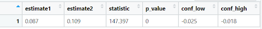

  

  

# Statistical Analysis 1: Spearman Correlation of Asthma Prevalence and Median AQI, 2013-2020
## Hypothesis
Our team hypothesizes that there would be a monotonic relationship between median AQI and asthma prevalence. We estimated the Spearman correlation of the two variables to assess whether there was a monotonic relationship.

* Hypotheses: 
   H0: ⍴ = 0
   H1:  ⍴ ≠ 0

* Estimates, Test Statistic, and P-Value: The Spearman correlation between median AQI and asthma prevalence for the period from 2013 to 2020 was -0.02, with a test statistic of 11,522,694 and a p-value of 0.72.

* Conclusion: Our p-value is greater than our alpha of 0.05. As such, we fail to reject the null hypothesis of no monotonic relationship at the 5% level of significance. 

* The Spearman correlation estimate for the period from 2013 to 2020 indicates no almost monotonic relationship between median AQI and asthma prevalence. This result is contrary to what the team expected. These results may be due to annual changes in the relationship between the variables, which are masked when assessed for the overall period from 2013 to 2020. Additionally, the result may be due to the limitations we have in our data. We are primarily limited to analyzing asthma prevalence at the state level since BRFSS does not disclose asthma prevalence for non-metropolitan counties. Looking at the relationship grouped at the state level may mask the relationship between median AQI and asthma prevalence at the sub-state or county level. Additionally, the team’s ability to detect a relationship between the two variables may also be due to our data only containing information on annual median AQI rather than daily AQI. 

  

# Statistical Analysis 2: Spearman Correlation of Asthma Prevalence and Median AQI by Year, 2013-2020

## Hypothesis
Our team hypothesizes that there would be a monotonic relationship between median AQI and asthma prevalence, but that the strength of the relationship may vary by year. We estimated the Spearman correlation of the two variables by year to assess whether there was a monotonic relationship and if the relationship varies by year. 

  

* Hypotheses: 
   H0: ⍴i = 0
   H1: ⍴i ≠ 0

* Where,
i = 2013 through 2020

* Estimates, Test Statistic, and P-Value: The Spearman correlation between median AQI and asthma prevalence ranged from -0.09 to 0.09 for the years from 2013 to 2019, with test statistics ranging from 20,193.57 to 23,974.60, and p-values ranging from 0.55 to 0.87. For the year 2020, the Spearman correlation estimate was 0.17, with a test statistic of 18,350.35 and a p-value of 0.23.

* The Spearman correlation estimates from 2013 to 2019 indicate almost no monotonic relationship between median AQI and asthma prevalence and the direction of the relationship varies depending on the year. The Spearman correlation estimate of 0.17 in 2020 indicates a weak positive monotonic relationship between median AQI and asthma prevalence. However, p-values in each year were less than our alpha of 0.05. As such, we fail to the reject the null hypothesis of no monotonic association between median AQI and asthma prevalence for each year from 2013 to 2020, at the 5% level of significance. 
* The Spearman correlation estimate for each year from 2013 to 2020 did vary per year, but each  indicated no almost monotonic relationship between median AQI and asthma prevalence. This result is contrary to what the team expected. These results may be due to annual changes in the relationship between the variables, which are masked when assessed for the overall period from 2013 to 2020. Additionally, the result may be due to the limitations we have in our data. We are primarily limited to analyzing asthma prevalence at the state level since BRFSS does not disclose asthma prevalence for non-metropolitan counties. Looking at the relationship grouped at the state level may mask the relationship between median AQI and asthma prevalence at the sub-state or county level. Additionally, the team’s ability to detect a relationship between the two variables may also be due to our data only containing information on annual median AQI rather than daily AQI.

  

# Statistical Analysis 3: Two Sample Test of Current Asthma Proportions for California and Wyoming, 2013-2020

## Hypothesis
Our team hypothesizes that there would be a statistically significant difference in the proportion of individuals with current asthma in the states of California and Wyoming. We tested this hypothesis by using a two-sided two-sample test of proportions. 

  

* Hypotheses: 
   H0: p1 = p2
   H1: p1 ≠ p2

* Estimates: The estimated proportion with current asthma is approximately 8.74% in California and 10.89% in Wyoming. 

* Test Statistic: The test statistic is 147.40 and follows a standard normal distribution. The p-value is less than 0.0001.

* 95% Confidence Interval: The 95% confidence interval ranges from -0.025 to -0.018.

* Conclusion: Our p-value is less than our alpha of 0.05. As such, we reject the null hypothesis and conclude that the proportion of individuals with current asthma in California compared to Wyoming is significantly different at the 5% level of significance. 

* The median of state AQI from 2013 to 2020 ranged from 20 to 47, which is a relatively limited range and is classified as having good air quality. Statistical tests have limited power to detect a statistically significant effect if there is insufficient difference between the exposure groups. To maximize our ability to detect a significant difference in the proportion with current asthma, the team compared Wyoming, the state with the lowest median AQI, and California, the state with the highest median AQI. Although Washington, D.C. is categorized as having the highest median AQI, the team chose to use California, the state with the second highest median AQI, since Washington, D.C. is not officially considered a state.

