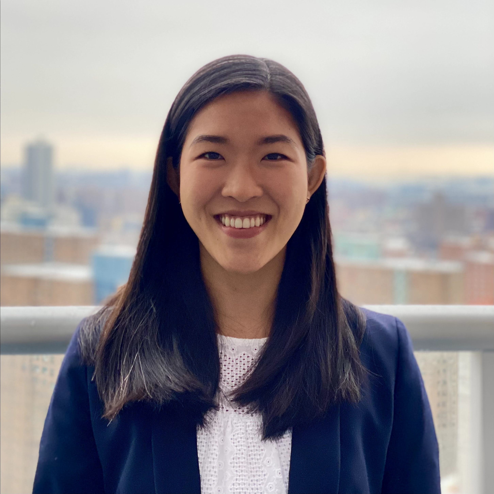

  

We are an interdisciplinary team formed during our second-year as candidates of the MPH program at Columbia University Mailman School of Public Health. This project was developed through Professor Jeff Goldsmith's P8105 data science class.

  

# Tara Ahi

I'm Tara Ahi.

You can learn more about me [here](https://taraahi.github.io/)

  

#  Gunnar Colleen

I'm Gunnar Colleen.

You can learn more about me [here](https://gcolleen.github.io/)

  

# Amanda Miles

I'm Mandy Miles.

You can learn more about me [here](https://acm2268.github.io/)

  

# Jodi Scharf

I'm Jodi Scharf

You can learn more about me [here](https://jodischarf.github.io/)

  

# Jocelyn Sun

I'm Jocelynn Sun.

You can learn more about me [here](https://jocelyynsun.github.io/)

  